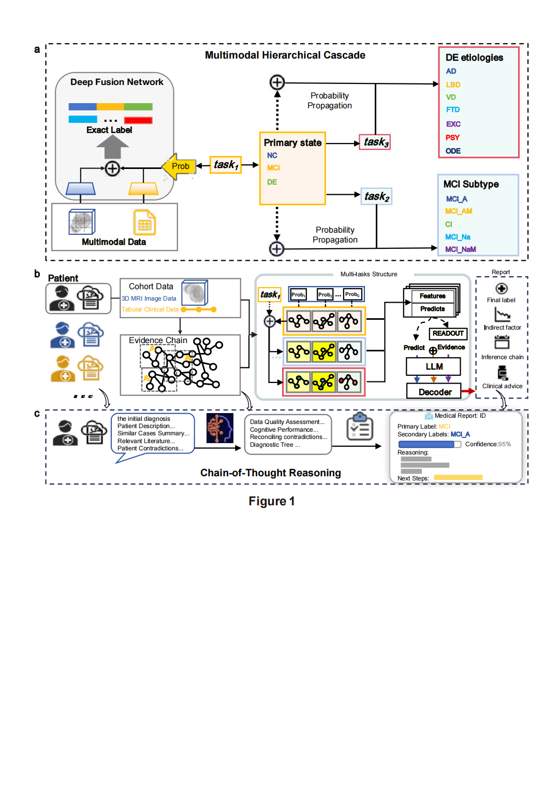

# A Multimodal Evidence-Driven Framework for Clinical Decision Support in Cognitive Impairment

---

## introduction

Deep learning approaches for cognitive impairment diagnosis have shown considerable promise, but their clinical translation remains limited by poor interpretability and weak linkage between model outputs and established medical evidence. Here we developed the Multimodal Evidence-Driven Reasoning Framework (MEDRF), which integrates a Multimodal Hierarchical Cascade (mHC) classifier with a retrieval-augmented large language model (RAG-LLM) for evidence-guided reasoning. MEDRF leverages routinely collected non-invasive data from clinical profiles and structural MRI to identify cognitive impairment stages and etiologies. Across 15 diagnostic labels, mHC outperformed flat multimodal baselines, supporting hierarchical diagnostic modelling. When the mHC was evaluated under progressive feature masking, performance declined with increasing missingness, whereas RAG-LLM correction mitigated this effect, especially under severe sparsity.



Fig. 1 | Overview of the Multimodal Evidence-Driven Reasoning Framework (MEDRF). 
a) Architecture of the multimodal hierarchical cascade (mHC). Left: The deep fusion network employs dual-stream encoders to fuse 3D MRI and tabular clinical data into a unified latent representation. Right: The Hierarchical mirrors clinical taxonomy, decomposing diagnosis into three progressive tasks: Primary State (Task 1), MCI Subtypes (Task 2), and Dementia Etiologies (Task 3). Probability propagation (dotted arrows) ensures that superordinate predictions explicitly condition and constrain the search space for fine-grained sub-typing.
b) End-to-end system workflow. Raw patient data (left) is processed through the trained multi-task structure (center), generating probabilistic predictions, visual features, and an interpretability evidence chain.
c) Mechanism of Chain-of-Thought (CoT) reasoning. The RAG-LLM synthesizes patient profiles with retrieved similar cases and medical guidelines. It executes a multi-step reasoning process—validating data quality, analyzing cognitive performance, and reconciling conflicting evidence—to produce a transparent, verifiable clinical report (right) containing confidence scores and next-step recommendations.

---

## Method Summary

- **Clinical tabular branch.** Tabular features are encoded by an MLP. Missing values are
  **not** fed to the MLP as raw `NaN`; instead, missing positions are imputed (numeric
  imputation or random-noise filling) and paired with a **binary missingness mask**
  (observed = 0, missing/masked = 1). See [docs/DATA.md](docs/DATA.md).
- **MRI image branch.** Structural MRI is processed through the UniBrain / MedKLIP-based
  pipeline (`adRAG/UniBrain-master`) to produce image-derived features. See
  [docs/MRI_EXTRACTION.md](docs/MRI_EXTRACTION.md).
- **mHC** — a multimodal hierarchical classifier producing the primary NC/MCI/DE diagnosis
  and downstream etiology/subtype outputs.
- **MEDRF** — multimodal evidence-driven fusion combining the two modalities with global
  priors via FiLM-style conditioning.
- **RAG-LLM prior correction.** A retrieval-augmented LLM converts structured features into
  text, retrieves evidence, and proposes a corrected prior. Only the first three dimensions
  of the global prior (NC / MCI / DE) are corrected, by **convex interpolation** with
  `alpha = 0.65`; **no softmax re-normalization** is applied, and **no thresholding** is
  applied before FiLM conditioning — thresholding is applied **only** to the final sigmoid
  outputs. See [docs/REPRODUCIBILITY.md](docs/REPRODUCIBILITY.md).

---

## Repository Structure

The original research structure is **preserved** (the code has working-directory-relative
path dependencies). Documentation, example configs, and scaffolding have been added around
it. For a per-file purpose table, see [docs/CODE_STRUCTURE.md](docs/CODE_STRUCTURE.md).

```
all_code/
├── README.md
├── requirements.txt
├── environment.yml                 # main-project conda template (regenerate locally)
├── .gitignore
├── LICENSE                         # CC BY-NC 4.0 + research-only notices
├── configs/
│   └── config.example.yaml
├── docs/
│   └── DATA.md
├── data/
│   └── README.md                   # data format spec (NO real data)
├── mHC.ipynb                       # mHC model + feature-sparsity experiments
├── results.ipynb                   # result statistics & visualization
└── adRAG/
    ├── main.py             # RAG-LLM pipeline (langgraph + LLM clients + FiLM)
    ├── ReportToCsv.py              # LLM report → CSV
    ├── deepseek_api.example.py     # template for the (gitignored) deepseek_api.py
    ├── Feature2Txt/                # feature → text + rule generation
    └── UniBrain-master/            # MRI feature-extraction pipeline (separate conda env)
        └── Brain_MRI/{configs, models, weights, docs}
```

---

## Environment Setup

Two environments are used: a **main project** environment (mHC, RAG-LLM, analysis) and a
separate **MRI feature-extraction** environment (`mri`). They are kept separate because the
MRI pipeline pins older, GPU/medical-imaging-specific versions.

### Main project (pip)

```bash
python -m venv .venv && source .venv/bin/activate     # or use conda below
pip install -r requirements.txt
```

### Conda Environment

```bash
# Create from the template (then regenerate to capture exact versions):
conda env create -f environment.yml
conda activate medrf
pip install -r requirements.txt

# To capture YOUR exact, reproducible environment (strip the prefix line):
conda env export --no-builds | grep -v '^prefix:' > environment.yml
```

> `environment.yml` here is a hand-written minimal template — it was **not** produced by
> `conda env export`. Please regenerate it on your machine for an exact lock.

### MRI Feature Extraction Environment

The MRI pipeline (`adRAG/UniBrain-master`) requires its own environment named `mri`. The
exact pinned dependency list lives in `adRAG/UniBrain-master/requirements.txt`. Full
instructions, environment export commands, input formats, and troubleshooting are in
[docs/MRI_EXTRACTION.md](docs/MRI_EXTRACTION.md).

```bash
# If you have already created the `mri` env, export it for sharing:
conda env export -n mri --no-builds | grep -v '^prefix:' > environment-mri.yml
conda list -n mri --export > conda-mri-explicit.txt
```

> `environment-mri.yml` and `conda-mri-explicit.txt` are **not** shipped in this repo;
> generate them locally from your `mri` environment using the commands above.

---

## Data Preparation

**Raw clinical data and MRI data cannot be publicly released** due to patient privacy,
ethical review constraints, and data-use agreements. You must prepare your own data
according to the description in the paper and in [docs/DATA.md](docs/DATA.md).

- Clinical tabular data: CSV with an `ID` column, feature columns, primary labels
  (`NC`, `MCI`, `DE`), and downstream etiology/subtype labels. Missing values are handled
  with imputation + a binary missingness mask (observed = 0, missing = 1).
- MRI data: NIfTI volumes (`.nii` / `.nii.gz`), referenced by path from a manifest/JSON.
- Configure all paths through `configs/paths.example.yaml` (copy to `paths.yaml`) and the
  per-module config files — do **not** hard-code machine-specific paths.

Place data outside version control; `data/` contains only documentation. See
[data/README.md](data/README.md).

---

## Training

The mHC model and the feature-sparsity experiments are implemented in **`mHC.ipynb`**.
Open it in Jupyter and run the cells in order after configuring your data paths:

```bash
jupyter lab mHC.ipynb     # or: jupyter notebook mHC.ipynb
```

---

## Evaluation

- Primary diagnosis (NC/MCI/DE) and downstream tasks are evaluated within the cross-
  validation loops in `mHC.ipynb`.
- Result statistics, calibration, ROC/AUC, confusion matrices, SHAP, and figures are
  produced in **`results.ipynb`**.

---

## RAG-LLM Correction Module

The RAG-LLM module (`adRAG/`) converts structured features to text, retrieves evidence, and
corrects the global prior.

1. **Provide LLM credentials.** The code imports LLM clients from local modules that are
   **not** committed (they hold secrets): copy the templates and fill in your keys —
   `adRAG/deepseek_api.example.py` → `adRAG/deepseek_api.py`, and
   `adRAG/poe_client.example.py` → `adRAG/poe_client.py`. These filenames are gitignored.
2. **Feature → text:** `adRAG/Feature2Txt/` (`feature_to_text.py`, `generate_rules.py`,
   `pipeline_feature_to_optimized_text1225.py`).
3. **Prior correction pipeline:** `adRAG/main.py`.

**Correction rule (exact):** only the first three prior dimensions (NC / MCI / DE) are
corrected via convex interpolation with `alpha = 0.65`; 
---

## Citation

If you use this code, please cite (placeholder — to be updated upon publication):

```bibtex
@article{hu2026medrf,
  title={A Multimodal Evidence-Driven Framework for Clinical Decision Support in Cognitive Impairment},
  author={Hu, Shicong and others},
  journal={To be updated},
  year={2026}
}
```

---

## License

This repository is released under **Creative Commons Attribution-NonCommercial 4.0
International (CC BY-NC 4.0)** — see [LICENSE](LICENSE). Use is permitted for
**non-commercial research only**; commercial use requires explicit prior written permission
from the authors.

---

### Disclaimer

This repository is provided **for research purposes only** and is **not** intended for
clinical deployment, diagnosis, treatment, or commercial use. No warranty is provided.
